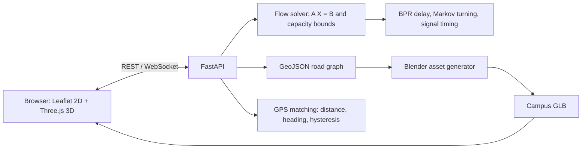

# ASTraM — Automated Smart Traffic Management

ASTraM is a traffic modeling and visualization system for the MIT World Peace University (MIT-WPU) campus in Pune. It combines a directed road graph, capacity-bounded flow estimation, congestion delay modeling, signal timing allocation, GPS map matching, and a live 2D/3D dashboard.

> **Data status:** `data/mit_wpu_roads.geojson` is a schematic traced from the included campus poster. Its pixel-to-WGS84 calibration, capacities, and road geometry are approximate; the Gate 1 North Bypass is illustrative. The browser map uses the poster image directly and has no external basemap tiles. Live GPS accuracy requires surveyed control points and confirmation of traced roads against campus data. Blender building blocks are illustrative proxies.

## Architecture



The flow solver uses a node-edge incidence matrix (`+1` at an edge source,
`−1` at its target) and solves `min ||A X − B||² + γ Σ(xᵢ/Cᵢ)²`, subject to
`0 ≤ xᵢ ≤ Cᵢ`. Positive boundary values represent entry supply; negative values
represent exit demand. The boundary vector must sum to zero. BPR travel times
use `Tᵢ = T₀,ᵢ(1 + 0.15(xᵢ/Cᵢ)^4)`. Markov turning matrices distribute inflow
among movements. Signal green splits follow approach saturation, with amber
clearance reserved inside the cycle. GPS matching uses a local meter projection,
Haversine cross-track distance, heading filtering, a 5 m snap limit, and
per-device hysteresis.

## Project structure

```text
app/                         FastAPI application and Python services
  api/endpoints.py           Flow, map-match, and network REST endpoints
  main.py                    App lifecycle, dashboard hosting, WebSocket stream
  schemas.py                 Pydantic API models
  services/flow_solver.py    Bounded matrix flow solver
  services/traffic_physics.py BPR, turning, capacity warnings, signals
  services/map_matching.py   GPS map-matching engine
data/mit_wpu_roads.geojson   Schematic campus road graph
docs/                        Engineering and Blender documentation
scripts/                      Blender generation and scenario simulation
static/                       CSS, browser JavaScript, generated GLB asset
templates/index.html          Dashboard page
tests/test_integration.py     Service and API integration suite
```

## Prerequisites and installation

Use Python 3.11 or newer. Blender 4.x is needed only to generate the 3D asset;
a WebGL-capable browser and internet access are needed for CDN libraries, map
tiles, and the browser-based 3D view.

### Windows PowerShell

```powershell
python -m venv .venv
.\.venv\Scripts\Activate.ps1
python -m pip install --upgrade pip
pip install -r requirements.txt
```

### macOS / Linux

```bash
python3 -m venv .venv
source .venv/bin/activate
python -m pip install --upgrade pip
pip install -r requirements.txt
```

## Generate the 3D campus asset

From the repository root, run:

```text
blender --background --python scripts/generate_3d_campus_placeholder.py
```

On Windows, if Blender is not on `PATH`, call its executable directly, for
example:

```powershell
& "C:\Program Files\Blender Foundation\Blender 4.5\blender.exe" --background --python scripts\generate_3d_campus_placeholder.py
```

The generated asset is `static/assets/mit_wpu_campus.glb`. The script creates
meter-scaled road ribbons and illustrative building massing. Read
[docs/3D_MODELING_WORKFLOW.md](docs/3D_MODELING_WORKFLOW.md) before replacing
the proxies with surveyed footprints. The 2D dashboard and API work without a
generated GLB; 3D view requires it.

## Start the backend and dashboard

From the repository root with the virtual environment active:

```text
uvicorn app.main:app --reload
```

Open [http://127.0.0.1:8000/](http://127.0.0.1:8000/) for the dashboard.
Interactive API docs: [http://127.0.0.1:8000/docs](http://127.0.0.1:8000/docs).
Health check: [http://127.0.0.1:8000/health](http://127.0.0.1:8000/health).

The browser dashboard combines a Leaflet campus-poster schematic and Three.js
campus view, scenario controls, browser GPS tracking, signal timings, capacity
alerts, and a reconnecting WebSocket client. The 2D view draws traced campus
roads over `static/assets/mit_wpu_campus_layout.png`; it does not request
OpenStreetMap or other map tiles. Leaflet, Tailwind, and Three.js libraries are
loaded from their configured CDNs.

## HTTP and WebSocket reference

| Method / path | Description |
| --- | --- |
| `GET /health` | Service and network readiness |
| `GET /api/v1/network` | GeoJSON enriched with the latest flow, saturation, speed, delay, and warning values |
| `GET /api/v1/devices` | Active devices, per-road counts/density, and rolling gate crossing estimates |
| `POST /api/v1/solve-flow` | Solve bounded flows; return BPR metrics, warnings, residuals, and signal timing |
| `POST /api/v1/map-match` | Match a device GPS fix to the road graph |
| `WS /ws/traffic-stream` | Two-second state stream: edges, signal phases, and simulated vehicle positions |

### Flow request

Send a direct node-to-flow dictionary. Values are in vehicles/hour and must
balance globally:

```json
{"node_1": 40, "node_7": 20, "node_8": -60}
```

The response contains solved vector `X`, saturation ratios, BPR delay penalties,
effective speeds, travel times, node conservation metrics, signal allocations,
and capacity warnings. Invalid or capacity-infeasible inputs return HTTP 422.

### GPS request

```json
{"device_id":"vehicle-17","latitude":18.5175,"longitude":73.8176,"heading":53,"speed":4.0}
```

The API speed unit is meters/second; the dashboard converts its km/h input.
Matcher history is retained per device for hysteresis. WebSocket vehicle
positions are simulated seed data, not live GPS observations.

## Integration tests

Run from the repository root:

```text
pytest
```

The suite covers flow conservation, capacity bounds and dynamic updates; BPR,
turning and signal calculations; map distance, heading rejection, off-network
detection and hysteresis; zero-capacity closure rerouting; and the health,
network, flow, and map-match API endpoints.

## Scenario simulator

Run all seed scenarios:

```text
python scripts/run_scenarios.py
```

Run one by name with `--scenario morning`, `--scenario evening`, or
`--scenario closure`. The runner prints edge flows, saturation, BPR delay,
capacity warnings, and green phase allocations.

The network models Gate 1 (`node_1`), Cast Gate (`node_7`), and Gate 3
(`node_8`) as boundary nodes. Scenario boundary flows must balance because the
solver represents steady-state conservation and does not represent vehicles
accumulating inside the network. The closure case sets edge `e1` capacity to
zero and routes Gate 1 demand over the illustrative alternative edge `e19`.

The browser's **Share My Live Location** control requests permission through
the HTML5 Geolocation API and submits periodic GPS fixes to
`POST /api/v1/map-match`. Active fixes are aggregated over a 60-second rolling
window and published over the traffic WebSocket. Device counts are occupancy
observations; their conversion to equivalent vehicle flow uses a configurable
demo assumption and is not a measured traffic count. Raw rolling gate hits are
exposed separately from the solver estimate; the latter pairs observed entry
and exit volumes at the lower total so the steady-state matrix remains
conservative when some devices are still inside campus.

## Operating assumptions

- Road capacities and flows are illustrative vehicles/hour.
- The solver models steady-state conservation, not dynamic queues or vehicle
  storage at intersections.
- Signal recommendations and traffic colors are visualization/decision-support
  outputs, not direct field-controller commands.
- CORS is permissive for local development. Restrict origins and add suitable
  authentication before exposing the service outside a trusted environment.
